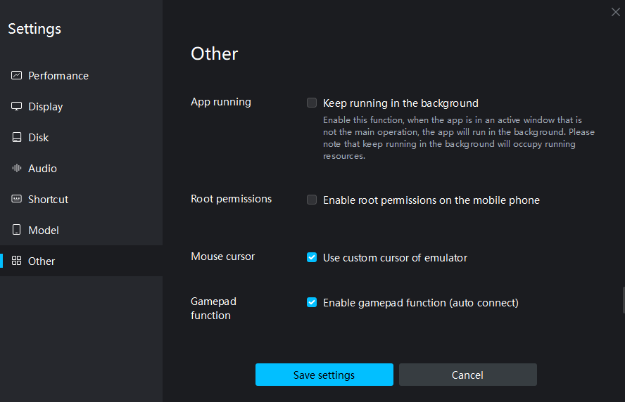

## ❓ 这是什么

这是一个自动阅读世界计划剧情的脚本，用于获取四周年版本后不跳过剧情可获得的总计180抽无料券以及邀请好友任务。
仅在MUMU模拟器上测试可用，在其他模拟器上使用可能需要自行调试

## 📖 使用方法

1. 拉取项目，并确保安装和配置完成Python环境
2. 在项目目录下创建Python虚拟环境
   ```python
   python -m venv venv
   ```
3. 安装依赖
   ```python
   pip install -r requirements.txt
   ```
4. 修改配置文件
   需要将config.py中的ADB_HOST修改为你的虚拟机提供的adb连接地址，其他设置保持默认即可
5. 运行脚本
   ```python
   python main.py
   ```


## 📝 注意事项

1. 该脚本仅支持1920x1080分辨率，无法在其他分辨率下运行
2. 该脚本编写与四周年版本（4.0.0），在该版本上测试可用，后续大版本如出现UI变化可能无法使用
3. 该脚本仅在MUMU模拟器上测试可用，在其他模拟器上使用可能需要自行调试；MacOS同理应该可用，如需在MacOS上运行可尝试使用MUMU模拟器Pro
4. UiAutomator2库目前无法正常获取开启了后台运行应用的虚拟机，如要使用请在虚拟机上关闭该功能
   
5. 测试时的显示设置：
   - 分辨率：1920x1080
   - DPI: 280
   - 亮度: 50%
   - 帧率：60
   - 动态调节帧率：关闭
   - 垂直同步：关闭
6. 建议保证网络环境良好的情况下使用，虽然有做断线重试处理，但没有经过测试，不一定能处理所有情况。另外网络条件不好的情况下阅读时会频繁出现黑屏加载的情况，效率极低

